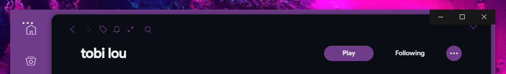
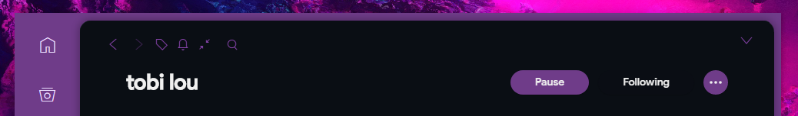

## SpotifyNoControl.ahk
for use with Spicetify's [dribbblish theme](https://github.com/morpheusthewhite/spicetify-themes/tree/master/Dribbblish).

Behaves like the original `SpotifyNoControl.exe` but with no command-line window appearing, it should work regardless of how you run it, and you can (optionally) pass the path to spotify as an argument.

*It does **not** combine the taskbar icon of spotify with it's own shortcut.*

